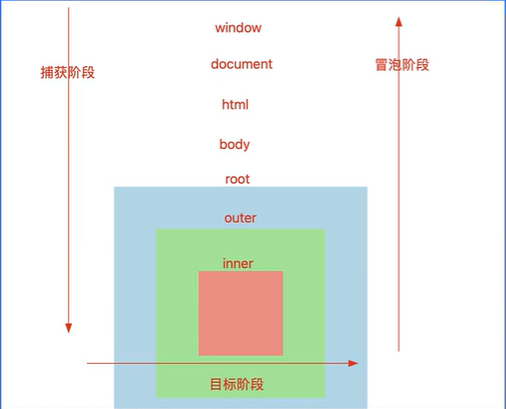

<!--
 * @Description: 
 * @Version: 3.0
 * @Author: ganyanping
 * @Date: 2023-03-13 15:39:29
 * @LastEditors: ganyanping
 * @LastEditTime: 2023-03-14 11:08:14
-->
---
title: 'JavaScript事件及事件委托'
date: 2022-03-01 12:44:15
tags:
- 'JavaScript'
categories:
- 'JavaScript'
---
### 事件传播机制
事件是具备传播机制，例如：当我们触发inner的点击行为的时候
 + 第一步：从最外层向最里层逐一查找（捕获阶段：分析出路径）
 + 第二步： 把事件源（点击这个元素）点击行为触发（目标阶段）
 + 第三步：按照捕获阶段分析出来的路径，从里到外，把每个元素的点击行为也触发（冒泡阶段）

```html
<div id="root">
  <div id="outer">
    <div id="inner">
    </div>
  </div>
</div>

<script>
  const html = document.documentElement,
  body = document.body,
  root = document.querySelector("#root"),
  outer = document.querySelector("#outer"),
  inner = document.querySelector("#inner");
  //  ev.stopPropagation 阻止事件的传播（包含捕获和冒泡）、
  // ev.stopImmediatePropagation:也是阻止事件传播，只不过他是把当前元素绑定的其他方法，如果还未执行，也不会在执行。
  root.addEventListener('click', funciton(ev){
    console.log('root捕获')
     ev.stopPropagation() // 阻止向下捕获
  },true)

  root.addEventListener('click', funciton(){
    console.log('root冒泡')
  },false)

  outer.addEventListener('click', funciton(){
    console.log('outer捕获')
  },true)

  outer.addEventListener('click', funciton(){
    console.log('outer冒泡')
  },false)

  inner.addEventListener('click', funciton(ev){
    console.log('inner捕获')
   
  },true)

  inner.addEventListener('click', funciton(){
    console.log('inner冒泡') 
     ev.stopPropagation() // 阻止向上冒泡
  },false)
</script>
```

**事件的传播机制： 先捕获->目标->冒泡**


### 事件委托
事件委托：利用事件传播机制，事件一套事件绑定处理方案

例如：一个容器中，有很多元素都要在点击的时候做一些事情。

+ 传统方案：首先获取需要操作的元素，然后逐一做事件绑定。
+ 事件委托：只需要给容器做一个事件绑定，点击内部的任何元素，根据事件的冒泡传播机制，都会让容器的点击事件也触发，我们在这里，根据事件源，做不同的事情就可以了。

事件委托优势：
+ 提高JS代码运气的性能，并且把处理的逻辑都集中在一起
+ 某些需求必须基于事件委托处理，例如：除了点击XXX外，点击其余的任何东西，都XXX
+ 给动态绑定的元素，做事件绑定。

```js
const body = document.body;
body.addEventListener('click', function(ev){
  console.log(ev.target)
})
``` 

### react中合成事件，处理机制
react中合成事件处理原理：react中的合成事件，都是基于事件委托处理的。
